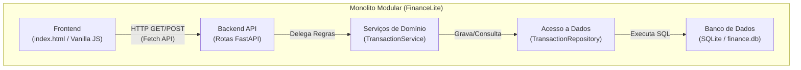
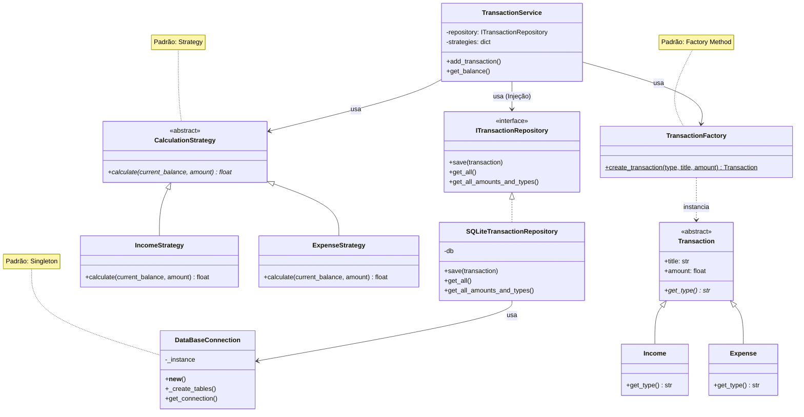
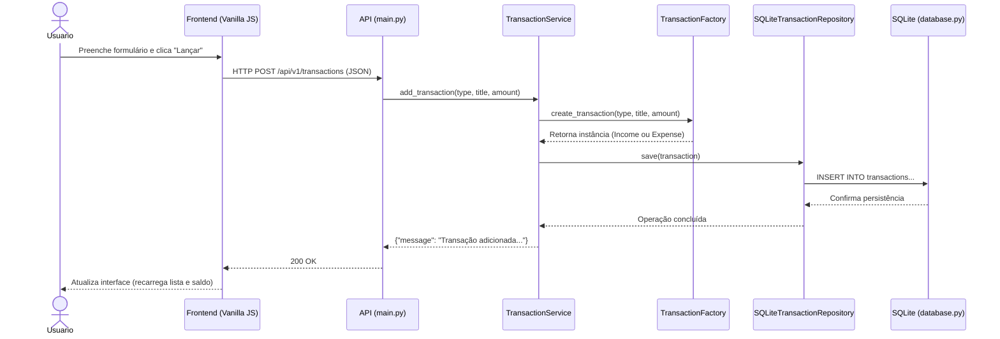

# Diagramas do Projeto FinanceLite

Aqui estão os diagramas em código Mermaid solicitados pelo professor. Você pode copiá-los e colá-los em ferramentas como o [Mermaid Live Editor](https://mermaid.live/) para gerar as imagens, ou diretamente no seu documento se a ferramenta suportar (como Notion, Obsidian ou extensões do VSCode).

## 1. Arquitetura Macro (Estilo C4 - Componentes/Containers)

## 2. Diagrama de Classes (Foco nos Padrões GoF)

## 3. Diagrama de Sequência (Fluxo Central: Adicionar Transação)

